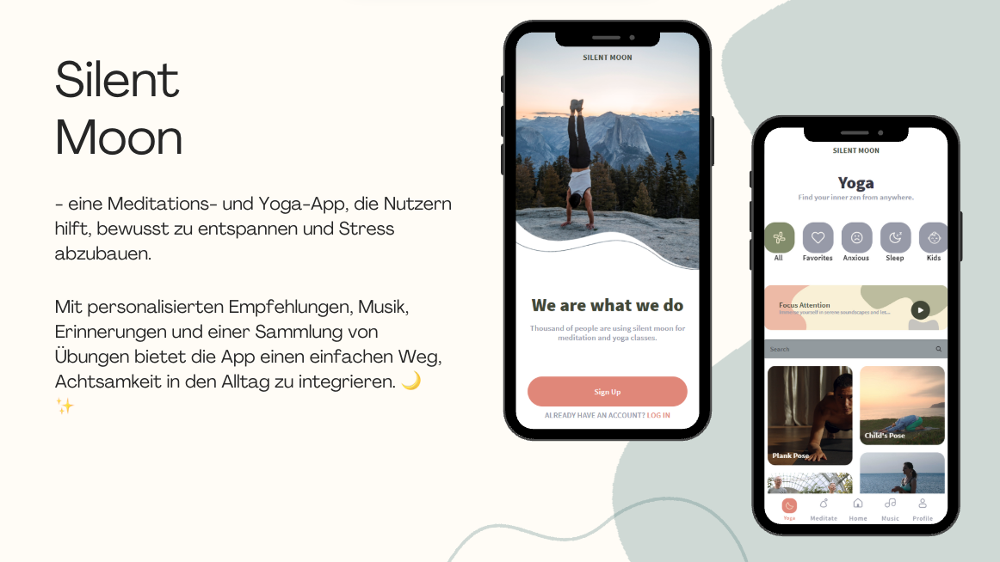

# SILENT MOON 🌙

**SILENT MOON** is a meditation and yoga app designed to help users consciously relax and reduce stress. With personalized recommendations, music, reminders, and a collection of exercises, the app provides an easy way to integrate mindfulness into daily life. 🌙✨

## Preview



### Or check it out live : [SILENT MOON](https://silent-moon.netlify.app/)

## Features

- **User Registration & Login**: Users can either register or log in directly if they are already registered.
- **Personalized Greetings**: Users are personally addressed and greeted upon login.
- **Home Page Recommendations**: Users receive recommendations for yoga or meditation on the home page.
- **Intuitive Search**: An easy-to-use search bar & category swipe bar to quickly find content.
- **Detailed Views**: Depending on the selection, users are directed to a detailed view with video or playlist and further information.
- **Favorite & Download**: Users can favorite or download content.
- **Music Player**: Clicking on a track in the playlist opens the music player for easy control.
- **Footer Navigation**: Users can navigate easily through symbols in the footer to reach their desired page.
- **User Profile**: Users have an overview of their favorited content, can edit their profile picture, and access the meditation reminder or log out.
- **Activity Pages**: Additional search options for subcategories on yoga and meditation activity pages.
- **Mini Player**: A recommended playlist track is played in the mini player. For the full tracklist view, users can access the music page.

## Technology Stack

- **Frontend**: Vite, React, TypeScript, Tailwind CSS
- **Libraries**: Daisy UI, Masonry and more
- **Routing**: React-Router
- **Backend**: Supabase
- **Design**: Figma template (mostly predefined)

## Development Team

Developed by a dedicated team of three:

- [FranticMario](https://github.com/FranticMario)
- [Daniel](https://github.com/griez97)
- [sharonVko](https://github.com/sharonVko)

## Installation

To install and run the app locally, follow these steps:

1. Clone the repository:
   ```bash
   git clone git@github.com:sharonVko/silent-moon.git
   ```
2. Navigate to the project directory:

   ```
   cd silent-moon

   ```

3. Install dependencies:

```
npm install

```

4. Start the development server:

```
npm run dev
```
